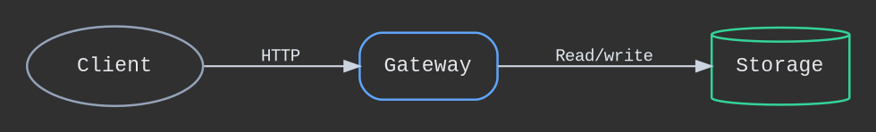

# Graphviz

This skill focuses on producing Graphviz (`dot`) diagrams that match a clean, modern architecture-doc look commonly used in repository visualizers.

Use the style package below as the default unless the user requests a different visual direction.

## Core workflow

1. Clarify diagram intent: choose directed/undirected graph and whether the flow is horizontal or vertical.
2. Build the diagram structure with explicit node and edge labels.
3. Apply the shared theme (global defaults + role-specific node/edge classes).
4. Render with `dot -Tsvg` (or equivalent) and verify readability at small and full scale.

## Default CodeWiki-style theme (for `.dot`)

## Role-specific presets

Apply these overrides for readability:

- Service / component nodes:
  - `shape=box`, `fillcolor="transparent"`, `color="#60a5fa"`
- API/external boundary:
  - `shape=hexagon`, `fillcolor="transparent"`, `color="#60a5fa"`
- Data store / cache:
  - `shape=cylinder`, `fillcolor="transparent"`, `color="#34d399"`
- Actor / client:
  - `shape=oval`, `fillcolor="transparent"`, `color="#94a3b8"`
- Async/error links:
  - `style=dashed`, `color="#b77b0f"`
- Optional paths:
  - `arrowhead=vee`, `style=solid`, `color="#9ca3af"`

## Direction and spacing guidance

Keep connectors non-curved by default with `splines=ortho`; switch to `splines=line` for strict straight segments.

- Use `rankdir=LR` for wide system overviews.
- Use `rankdir=TB` for process flows and lifecycle sequences and add `center=true` so blocks stay centered vertically.
- For dense diagrams, reduce with:
  - `nodesep=0.25`
  - `ranksep=0.25`
  - shorter labels and tighter `fontsize` (9–10).

## SVG optimization tips

- Export with:
  - `dot -Tsvg input.dot > output.svg`
- If text is blurry in an embedding context, reduce `fontsize` by 1 and increase `margin` slightly.
- For transparent backgrounds: set `bgcolor=transparent`.
  - Prefer 1st-level grouping using `subgraph cluster_*` with:
    - `label`, `color="#64748b"`, `style=rounded`, `fillcolor="transparent"`, `bgcolor="transparent"`.

## Template to start from

## References

- `references/codewiki-style.md` for reusable snippets and quick color presets.
- `assets/codewiki-theme.dot` for a ready-to-edit base DOT file.
