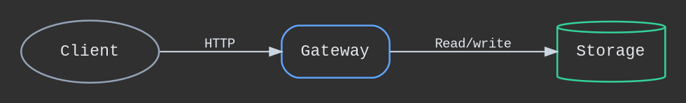

# CodeWiki-style Graphviz reference

Use this when you want a clean, consistent diagram style with low visual noise and predictable edge routing.

## Palette

- canvas: `#303030`
- panel/stroke: `#64748b`
- text dark: `#e5e7eb`
- text secondary: `#cbd5e1`
- node stroke: `#9ca3af`
- node fill: `transparent`
- service accent: `#4f46e5`
- db fill: `transparent`
- db stroke: `#34d399`
- client stroke: `#94a3b8`
- edge: `#cbd5e1`
- warning edge: `#b77b0f`

## Node roles

- **Component**: `shape=box`, rounded corners, transparent fill, subtle dark border.
- **External/API**: `shape=box`, `fillcolor="transparent"`, `color="#60a5fa"`.
- **Data store**: `shape=cylinder`, `fillcolor="transparent"`, `color="#34d399"`.
- **Actor/user/client**: `shape=oval`, `fillcolor="transparent"`, `color="#94a3b8"`.

## Edge conventions

- Default flow: `arrowhead=normal`, `color="#cbd5e1"`.
- Dependency: `style=solid`.
- Optional edge: `style=dashed`, `color="#9ca3af"`.
- Async path / warning: `style=dashed`, `color="#b77b0f"`, `arrowhead=vee`.

## Safe fallback fonts

Use this stack in user-facing docs that may not have custom fonts:
`Courier New`, `Menlo`, `Monaco`, `Consolas`, `monospace`.

## Rendering defaults

```
dot -Tsvg diagram.dot > diagram.svg
```

If labels clip, set `nodesep=0.8`, `ranksep=0.8`, and reduce font size from 11 to 10.

If edge lines cross too much, prefer:

- `rankdir=LR` (or `TB` for stack-like flows),
- `nodesep=0.9`,
- `ranksep=0.85`,
- `splines=ortho`,
- `remincross=true`,
- `ordering=out`.
- `center=true` when `rankdir=TB` for centered vertical blocks.

## Example theme block



Use `splines=ortho` for orthogonal lines. Use `splines=line` if you need purely straight connectors.
