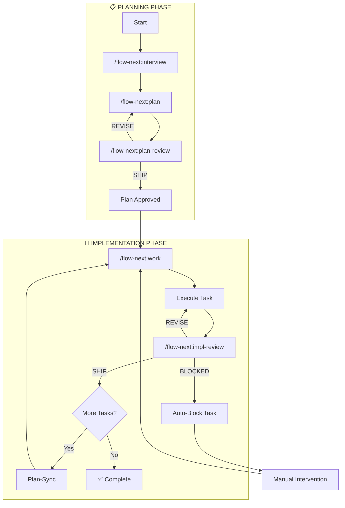
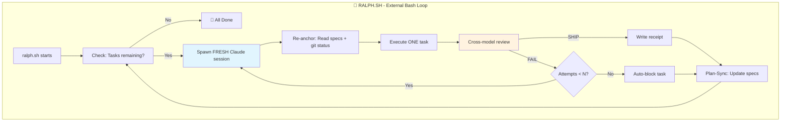
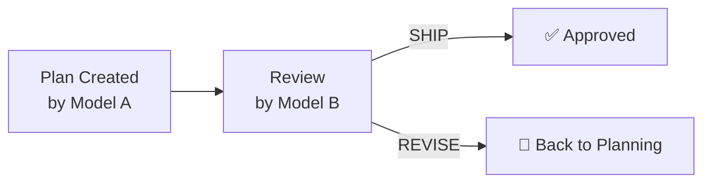
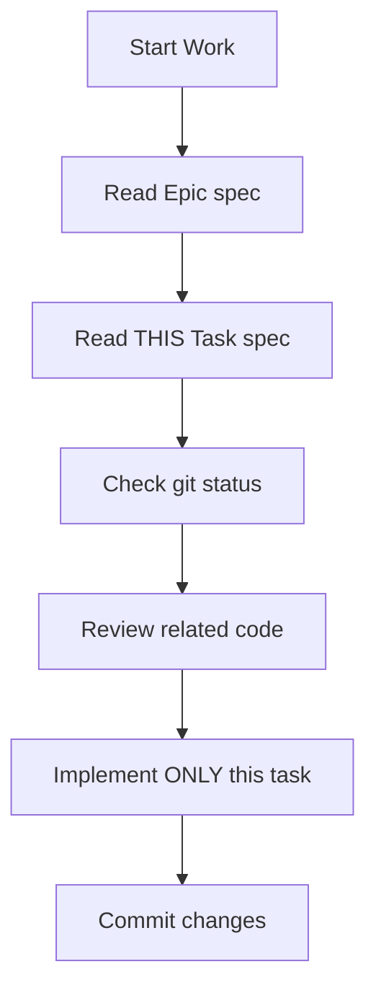
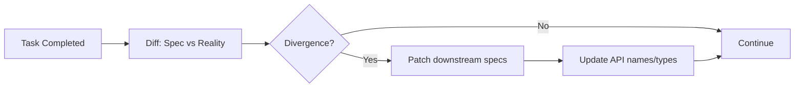
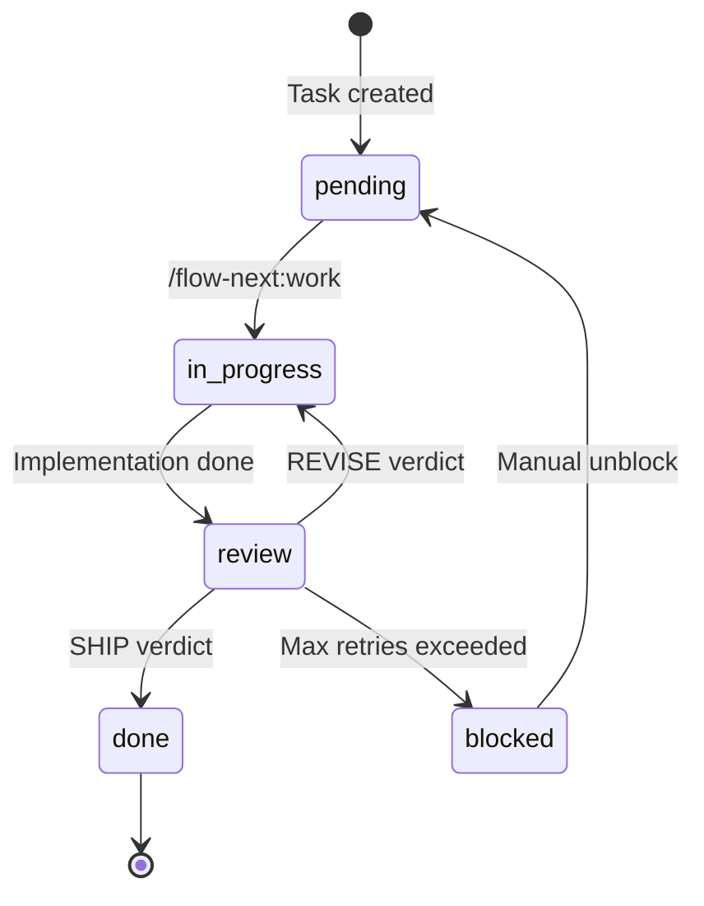
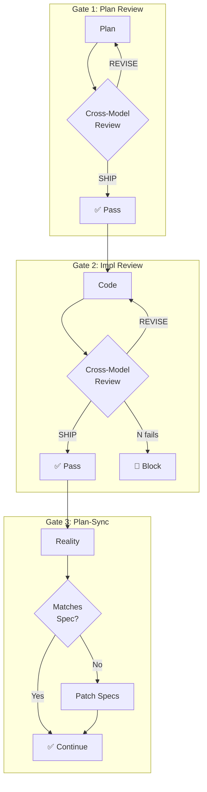

# Flow-Next: Stages & Phases Explained

**Created:** 2026-01-17  
**Based on:** flow-next-deep-dive.md  
**Author:** Gordon Mickel (@gmickel)

---

## Overview

Flow-Next is a **plan-first, file-based** workflow for AI coding agents. It treats AI like a distributed system with receipts, gates, and external orchestration.

---

## High-Level Workflow



---

## The Ralph Mode Loop (Autonomous)



**Key Insight:** The loop runs OUTSIDE Claude. Each iteration = brand new context window. Failed attempts don't pollute future runs.

---

## Phase Definitions

### 📋 `/flow-next:plan`
**Purpose:** Research codebase and create structured work breakdown

| What it does | Why it matters |
|--------------|----------------|
| Analyzes existing code patterns | Prevents reinventing the wheel |
| Creates Epic spec (high-level) | Documents the "what" and "why" |
| Breaks into Task specs | Atomic units of work (~4 hrs max) |
| Identifies dependencies | Proper execution order |

**Output:** `.flow/epics/EPIC-XXX.md` + `.flow/tasks/TASK-XXX-NNN.md`

---

### 🎤 `/flow-next:interview`
**Purpose:** Deep requirements gathering before planning

| What it does | Why it matters |
|--------------|----------------|
| Asks 40+ clarifying questions | Catches ambiguity early |
| Refines scope and constraints | Prevents scope creep |
| Documents decisions | Creates audit trail |

**When to use:** Complex features, unclear requirements, new domains

---

### 🔍 `/flow-next:plan-review`
**Purpose:** Cross-model validation of the plan



**Why cross-model?** Same model reviewing its own work has blind spots. Different model catches different issues.

---

### 🔨 `/flow-next:work`
**Purpose:** Execute tasks with re-anchoring

**The Re-Anchoring Pattern:**


**Why re-anchor?** Fresh sessions don't remember the plan. Re-reading specs ensures alignment every time.

---

### ✅ `/flow-next:impl-review`
**Purpose:** Cross-model code review

| Verdict | Meaning | Action |
|---------|---------|--------|
| `SHIP` | Code meets spec | Proceed to next task |
| `REVISE` | Issues found | Retry implementation |
| `BLOCK` | Fundamental problem | Auto-block, needs human |

**Receipt generated:**
```json
{
  "type": "impl_review",
  "task_id": "TASK-001-003",
  "verdict": "SHIP",
  "reviewer": "claude-sonnet",
  "timestamp": "2026-01-17T21:00:00Z"
}
```

---

### 🔄 `/flow-next:ralph-init`
**Purpose:** Scaffold the autonomous loop infrastructure

**Creates:**
```
scripts/ralph/
├── ralph.sh          # Main loop (bash)
├── ralph_once.sh     # Single iteration (for testing)
├── config.env        # Settings (max retries, models, etc.)
└── hooks/            # Custom pre/post task hooks
```

---

## Plan-Sync Subagent



**Purpose:** Specs drift from reality during implementation. Plan-Sync keeps them aligned.

**Example:** Task 1 creates `UserService.authenticate()` but spec said `AuthService.login()`. Plan-Sync updates Tasks 2-10 to reference the real method name.

---

## State Machine: Task Lifecycle



---

## File Structure (`.flow/` directory)

```
.flow/
├── state.json              # Current workflow state
├── epics/
│   └── EPIC-001.md         # Epic-level spec
├── tasks/
│   ├── TASK-001-001.md     # Task specs
│   ├── TASK-001-002.md
│   └── TASK-001-003.md
├── research/
│   └── RES-001.md          # Research findings
├── reviews/
│   ├── plan-review-001.md  # Plan review receipts
│   └── impl-review-001-001.md
└── receipts/
    └── receipts.jsonl      # All receipts (append-only)
```

---

## Quality Gates Summary



---

## TL;DR - What Each Command Does

| Command | Phase | One-liner |
|---------|-------|-----------|
| `interview` | Pre-planning | Deep requirements Q&A |
| `plan` | Planning | Create epic + task breakdown |
| `plan-review` | Planning | Cross-model plan validation |
| `work` | Implementation | Execute one task (re-anchored) |
| `impl-review` | Implementation | Cross-model code review |
| `ralph-init` | Setup | Create autonomous loop scripts |

---

## Key Principles

1. **Plan before code** — No implementation without specs
2. **Fresh context always** — Each task = new session
3. **Re-anchor every time** — Read specs before working
4. **Cross-model review** — Two models > one model
5. **Receipts gate progress** — No receipt = no advance
6. **File I/O is state** — `.flow/` is source of truth, not transcript
7. **External orchestration** — Bash controls Claude, not vice versa

---

*This is GitOps for AI agents.* 🚀
