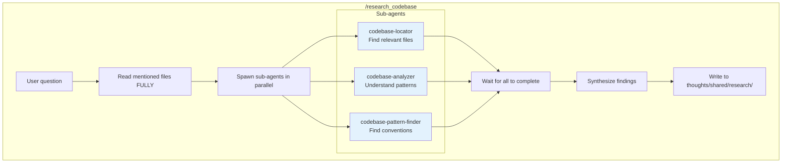
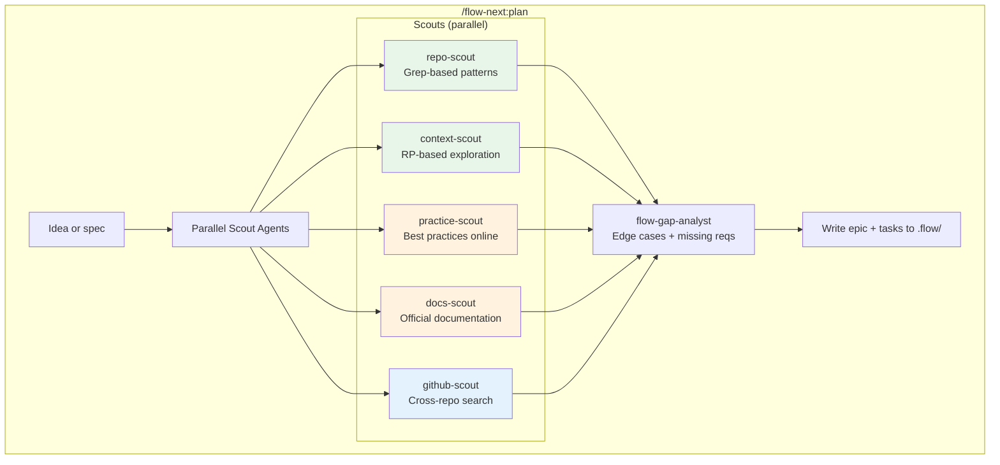
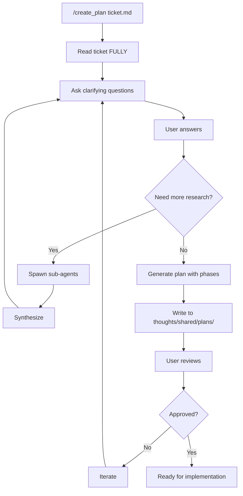
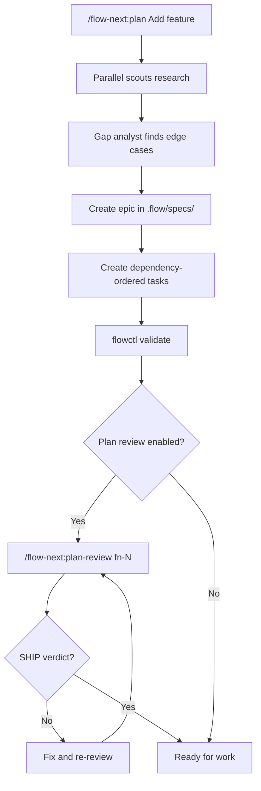
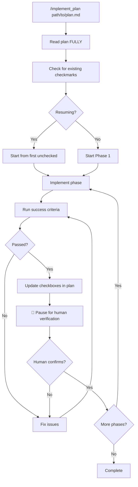
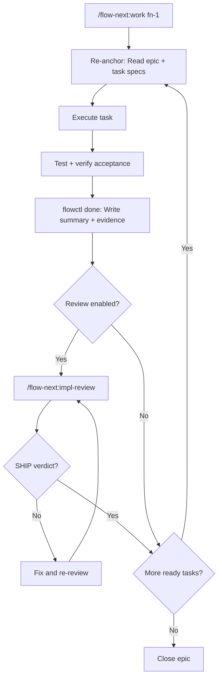
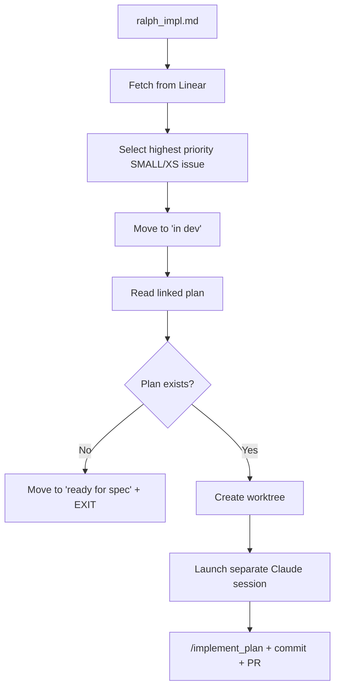
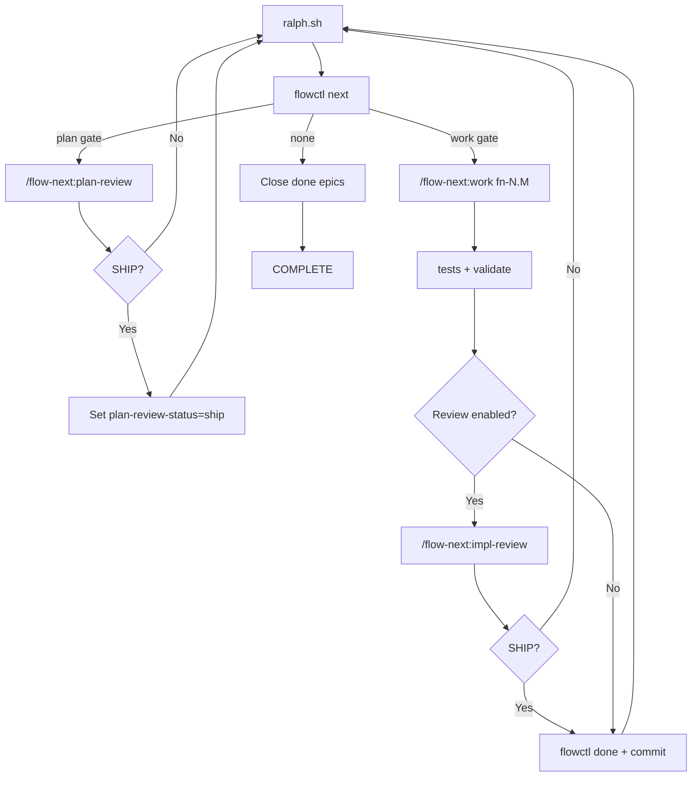

# Deep Analysis: HumanLayer vs Flow-Next

**Created:** 2026-01-17  
**Question:** How do these systems handle Research → Plan → Implement? What about documenting existing repos?

---

## Quick Comparison

| Aspect | HumanLayer | Flow-Next |
|--------|------------|-----------|
| **Platform** | Claude Code (`.claude/commands/`) | Claude Code (plugin) |
| **Philosophy** | Ticket-driven, thoughts directory | Epic-first, .flow directory |
| **Sub-agents** | ✅ Heavy use (codebase-locator, analyzer, etc.) | ✅ Scouts (repo-scout, practice-scout) |
| **Existing codebase docs** | ✅ `/research_codebase` | ⚠️ Manual (interview + memory) |
| **Autonomous mode** | Ralph variants | Ralph mode |
| **External integrations** | Linear, worktrees | RepoPrompt, Codex CLI |

---

## Research Phase

### HumanLayer: `/research_codebase`

**Purpose:** Document existing code WITHOUT critiquing it



**Key principles:**
- **NO critique mode** — only documents what exists
- **Parallel sub-agents** — faster, more thorough
- **Thoughts directory** — persistent knowledge base
- **Read FULLY** — no limit/offset, complete context

**Output structure:**
```yaml
# thoughts/shared/research/RES-topic.md
---
type: research
created: 2026-01-17
last_updated: 2026-01-17
git_commit: abc123
tags: [auth, middleware, security]
---

# Research: Authentication Flow

## Overview
[High-level description]

## Components
[Where things live]

## How It Works
[Flow descriptions]

## Key Files
[File references with line numbers]
```

---

### Flow-Next: Research During Planning

Flow-Next doesn't have a standalone research command. Research happens as part of `/flow-next:plan`:



**Key difference:** Research is **coupled to planning**, not standalone.

---

## Planning Phase

### HumanLayer: `/create_plan`

**Interactive, iterative process:**



**Plan template:**
```markdown
# Implementation Plan: [Title]

## Overview
[What we're building]

## Phases

### Phase 1: [Name]
**Changes:**
- [ ] Change 1
- [ ] Change 2

**Success Criteria:**
- Test X passes
- Behavior Y verified

### Phase 2: [Name]
...

## Risks & Mitigations
[Identified risks]

## Open Questions
[Unresolved items]
```

**Key features:**
- **Skeptical approach** — questions vague requirements
- **Interactive** — multiple rounds with user
- **Phase-based** — not just tasks, but logical phases
- **Success criteria per phase** — clear verification

---

### Flow-Next: `/flow-next:plan`

**Automated, single-pass (unless reviewed):**



**Output structure:**
```
.flow/
├── specs/fn-1-abc.md    # Epic spec (narrative)
├── epics/fn-1-abc.json  # Epic metadata
└── tasks/
    ├── fn-1-abc.1.json  # Task metadata (deps, status)
    ├── fn-1-abc.1.md    # Task spec (narrative)
    └── ...
```

**Key features:**
- **Epic-first** — every unit of work belongs to an epic
- **Dependency graphs** — tasks declare blockers
- **Cross-model review** — GPT reviews Claude's plan (optional)
- **Collision-resistant IDs** — `fn-N-xxx` format for team safety

---

## Implementation Phase

### HumanLayer: `/implement_plan`



**Key features:**
- **Phase-based execution** — not task-by-task
- **Human pause gates** — stops after each phase for manual testing
- **Checkbox tracking** — progress tracked in the plan file itself
- **Reality adaptation** — follows plan's intent, adapts to what's found

**Mismatch handling:**
```
Issue in Phase [N]:
Expected: [what the plan says]
Found: [actual situation]
Why this matters: [explanation]
How should I proceed?
```

---

### Flow-Next: `/flow-next:work`



**Key features:**
- **Re-anchoring every task** — prevents drift
- **Dependency ordering** — `flowctl ready` determines what can start
- **Evidence recording** — commits, tests, PRs logged
- **Cross-model review** — second model catches blind spots

---

## Autonomous Mode (Ralph)

### HumanLayer: `ralph_` commands



**Integration points:**
- **Linear** — issue tracking
- **Worktrees** — isolated branches
- **HumanLayer CLI** — launches separate sessions

---

### Flow-Next: Ralph Mode



**Key differences:**
| Aspect | HumanLayer Ralph | Flow-Next Ralph |
|--------|------------------|-----------------|
| Issue tracking | Linear integration | Internal flowctl |
| Branch strategy | Worktree per ticket | Single ralph-<run> branch |
| Session management | Separate Claude sessions | Fresh context per iteration |
| Review | Human pause gates | Cross-model review gates |
| Retry handling | Not specified | Auto-block after N failures |

---

## Documenting Existing Repos (Steering Docs)

### The Question
> "For existing repos, if I want to document requirements/specs aka research, is there something supported?"

### AWS Kiro: Steering Docs

Kiro has dedicated "steering docs" — persistent knowledge files that:
- Document conventions, patterns, APIs
- Are read at the start of each session
- Help the AI understand the codebase
- Located in `.kiro/steering/`

```
.kiro/
└── steering/
    ├── architecture.md      # System architecture
    ├── conventions.md       # Coding standards
    ├── api-patterns.md      # API design patterns
    └── testing.md           # Test conventions
```

---

### HumanLayer: `thoughts/` Directory ✅

**This is their steering docs equivalent:**

```
thoughts/
├── shared/                  # Team-wide knowledge
│   ├── research/           # Codebase research documents
│   │   └── RES-auth-flow.md
│   ├── plans/              # Implementation plans
│   ├── tickets/            # Fetched Linear tickets
│   └── templates/          # Document templates
│
└── allison/                # Personal workspace (per-developer)
    ├── tickets/
    └── notes/
```

**How to document existing code:**
```bash
/research_codebase "How does the authentication system work?"
# → Outputs to thoughts/shared/research/RES-auth-flow.md

/research_codebase "What are our API patterns?"
# → Outputs to thoughts/shared/research/RES-api-patterns.md

/research_codebase "How is the database layer structured?"
# → Outputs to thoughts/shared/research/RES-database.md
```

**Key:** The `thoughts/` directory is persistent and committed to the repo.

---

### Flow-Next: No Dedicated Command ⚠️

Flow-Next **does not have** an explicit `/research_codebase` or steering docs command.

**Closest alternatives:**

#### 1. Memory System (Opt-in)

```bash
flowctl config set memory.enabled true
flowctl memory init
```

```
.flow/memory/
├── pitfalls.md      # Lessons from failed reviews
├── conventions.md   # Project patterns
└── decisions.md     # Architectural choices
```

**Manual entries:**
```bash
flowctl memory add --type convention "Always use flowctl rp wrappers"
flowctl memory add --type decision "SQLite over Postgres for simplicity"
```

**Automatic capture:** In Ralph mode, NEEDS_WORK reviews auto-capture to `pitfalls.md`.

**Limitation:** Memory is for **learnings**, not comprehensive codebase documentation.

---

#### 2. Interview + Manual Research

```bash
/flow-next:interview "Document the authentication system"
```

This runs 40+ deep questions but is designed for **spec refinement**, not codebase documentation.

**Workaround:** Create a "research epic" manually:

```bash
# Create a research-only epic
flowctl epic create --title "Document authentication system"
flowctl task create --epic fn-1 --title "Map auth flow"
flowctl task create --epic fn-1 --title "Document API patterns"
flowctl task create --epic fn-1 --title "Identify conventions"

# Use /flow-next:work to execute each task
/flow-next:work fn-1.1
```

Then commit the `.flow/specs/fn-1.md` as your steering doc.

---

#### 3. RepoPrompt Integration (context-scout)

If you have RepoPrompt installed, `context-scout` provides deeper codebase exploration during planning. But again, it's tied to planning, not standalone.

---

## Gap: What Flow-Next Needs

To match HumanLayer/Kiro for existing codebase documentation:

```markdown
# Proposed: /flow-next:research

## What it would do
1. Accept a research question or area
2. Spawn scouts in parallel (repo-scout, practice-scout)
3. Write research document to .flow/research/ (not specs/)
4. No epic/task creation — pure documentation

## Output
.flow/
└── research/
    └── RES-auth-system.md

## Usage
/flow-next:research "How does authentication work?"
/flow-next:research "What are our API patterns?"
/flow-next:research "Document the database layer"
```

**For now:** Use HumanLayer's approach or create research epics manually.

---

## Recommendation by Scenario

| Scenario | Recommended Approach |
|----------|---------------------|
| **New greenfield feature** | Flow-Next: `/flow-next:plan` → `/flow-next:work` |
| **Document existing codebase** | HumanLayer: `/research_codebase` |
| **Existing spec, need breakdown** | Flow-Next: `/flow-next:plan specs/my-feature.md` |
| **Overnight autonomous run** | Flow-Next Ralph (more mature) |
| **Linear/GitHub issue integration** | HumanLayer Ralph variants |
| **Team with conventions** | Either + memory/thoughts for persistence |

---

## Hybrid Approach: Best of Both

You can use **both** in the same repo:

```
project/
├── .claude/commands/           # HumanLayer commands
│   └── research_codebase.md
├── .flow/                      # Flow-Next state
│   ├── specs/
│   ├── tasks/
│   └── memory/
└── thoughts/                   # HumanLayer persistent knowledge
    └── shared/
        └── research/
```

**Workflow:**
1. Use HumanLayer's `/research_codebase` to document existing code
2. Use Flow-Next's `/flow-next:plan` for new features
3. Cross-reference: plans can cite `thoughts/shared/research/` documents

---

## Summary

| Capability | HumanLayer | Flow-Next | Kiro |
|------------|------------|-----------|------|
| **Standalone codebase research** | ✅ `/research_codebase` | ❌ Manual workaround | ✅ Steering docs |
| **Research during planning** | ✅ Sub-agents | ✅ Scouts | ✅ Built-in |
| **Persistent knowledge** | ✅ `thoughts/` | ⚠️ Memory (limited) | ✅ Steering docs |
| **Interactive planning** | ✅ Back-and-forth | ⚠️ Single pass + review | ✅ Interactive |
| **Cross-model review** | ❌ Human gates | ✅ RP/Codex | ❌ Single model |
| **Dependency management** | ❌ Phase-based | ✅ DAG with flowctl | ✅ Built-in |

**The gap:** Flow-Next needs a `/flow-next:research` command for standalone codebase documentation to match HumanLayer/Kiro's steering docs capability.

---

*References:*
- [HumanLayer .claude/commands](https://github.com/humanlayer/humanlayer/tree/main/.claude/commands)
- [Flow-Next README](https://github.com/gmickel/gmickel-claude-marketplace/blob/main/plugins/flow-next/README.md)
- [Kiro Steering Docs](https://kiro.dev/docs/steering/)
