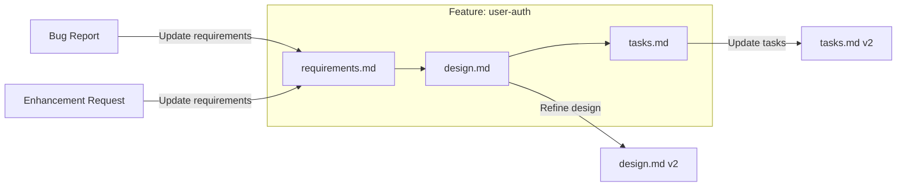
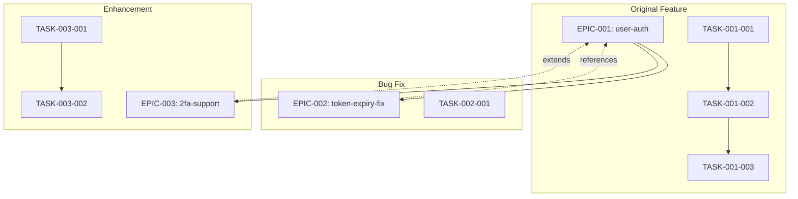
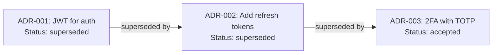
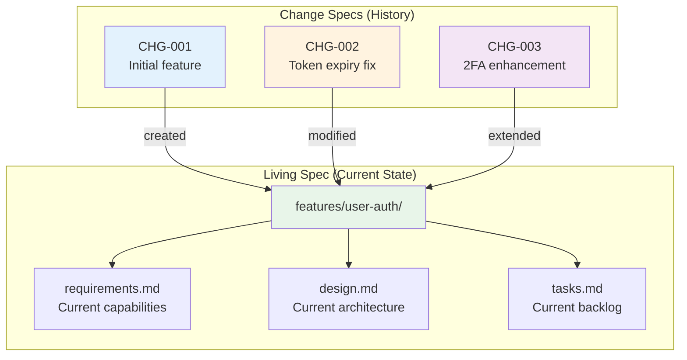
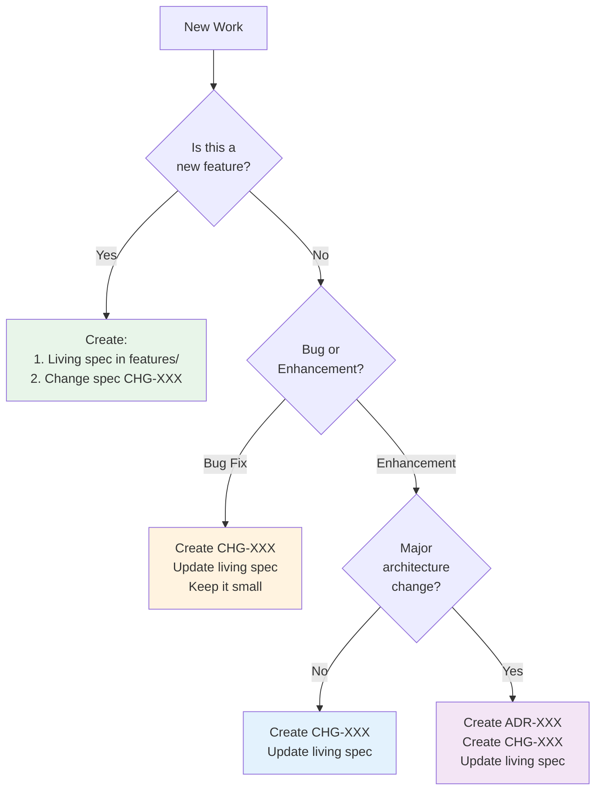

# Spec Lifecycle: Handling Bug Fixes & Enhancements

**Created:** 2026-01-17  
**Question:** After a feature is complete and spec is pinned, how do we handle bug fixes and enhancements?

---

## The Core Problem

```
Timeline:
├── Jan: Ship user-auth feature ✅ (EPIC-001 complete, spec committed)
├── Mar: Bug - token expiry not handled properly
└── Jun: Enhancement - add 2FA support

Questions:
1. Do I create new specs? (Now I have 2-3 files for "one feature")
2. Do I modify the original? (Lose history of discrete changes)
3. How do I trace what changed when?
```

---

## How Different Systems Handle This

### 1. AWS Kiro: **Mutable Living Specs** ✅

Kiro treats specs as living documents that evolve with the codebase.



**How it works:**
1. **Bug fix:** Open spec session → "Add requirement: handle token expiry" → Refine design → Update tasks
2. **Enhancement:** Same flow - add new requirements, refine design, add tasks
3. **History:** Git tracks all changes

**Pros:**
- Single source of truth per feature
- Simple mental model
- No spec sprawl

**Cons:**
- Harder to see "what was the bug fix scope?"
- Relies on Git history for archaeology

---

### 2. Flow-Next: **Epic-per-Change** (Implied)

Flow-Next doesn't explicitly document this, but the pattern is **one epic per unit of work**:



**How it works:**
```markdown
# EPIC-002: Token Expiry Fix

## References
- Extends: EPIC-001 (user-auth)
- Fixes: Issue #234

## Context
EPIC-001 implemented user authentication but didn't handle 
token expiry gracefully. This causes 401 errors without retry.

## Tasks
- TASK-002-001: Add token refresh middleware
```

**Pros:**
- Clear scope per change
- Discrete receipts
- Easy to audit "what was the fix?"

**Cons:**
- Specs scattered across multiple files
- Harder to see "current state of user-auth"

---

### 3. ADRs: **Immutable + Supersedes**

Architectural Decision Records use an immutable pattern:



**ADR lifecycle:**
```
Status: proposed → accepted → deprecated → superseded
```

**When to supersede:**
- Original decision proven wrong (bug)
- Context changed (enhancement)
- Better option discovered

**Pros:**
- Full decision history
- Rationale preserved
- Clear supersession chain

**Cons:**
- Heavy ceremony for small changes
- Need to read multiple docs for current state

---

## My Recommendation: **Hybrid Approach**

Combine the best of both worlds:

```
.specs/
├── features/                    # Living feature specs (current state)
│   └── user-auth/
│       ├── requirements.md      # Current requirements (evolving)
│       ├── design.md            # Current design (evolving)
│       └── tasks.md             # Current task backlog
│
├── changes/                     # Discrete change specs (append-only)
│   ├── CHG-001-user-auth-initial.md    # Original feature
│   ├── CHG-002-token-expiry-fix.md     # Bug fix
│   └── CHG-003-2fa-enhancement.md      # Enhancement
│
└── decisions/                   # ADRs for major architectural changes
    ├── ADR-001-jwt-auth.md
    └── ADR-002-2fa-approach.md
```

### Mermaid: The Hybrid Flow



---

## Templates

### Living Feature Spec (features/user-auth/requirements.md)

```markdown
# User Authentication

## Current Capabilities
- [x] Email/password login
- [x] JWT tokens with refresh
- [x] Token expiry handling (added CHG-002)
- [ ] 2FA support (in progress: CHG-003)

## Change History
| Change | Type | Date | Description |
|--------|------|------|-------------|
| CHG-001 | Feature | 2026-01 | Initial implementation |
| CHG-002 | Bug Fix | 2026-03 | Token expiry handling |
| CHG-003 | Enhancement | 2026-06 | 2FA support |

## Current Requirements
[... detailed requirements ...]
```

### Change Spec (changes/CHG-002-token-expiry-fix.md)

```markdown
# CHG-002: Token Expiry Fix

## Metadata
- **Type:** Bug Fix
- **Feature:** user-auth
- **Status:** ✅ Complete
- **Created:** 2026-03-15
- **Completed:** 2026-03-17

## Problem
Users see 401 errors when JWT expires. No automatic refresh.

## References
- **Issue:** #234
- **Original Feature:** CHG-001

## Solution
Add middleware to intercept 401, refresh token, retry request.

## Tasks
- [x] Add token refresh middleware
- [x] Update error handling
- [x] Add retry logic
- [x] Update tests

## Files Changed
- src/middleware/auth.ts
- src/utils/token.ts
- tests/auth.test.ts

## Verification
- [x] Token refresh works
- [x] No 401 errors for valid users
- [x] Tests pass
```

---

## Decision Guide: When to Use What



| Scenario | Living Spec | Change Spec | ADR |
|----------|-------------|-------------|-----|
| New feature | Create | Create CHG-XXX | Maybe |
| Small bug fix | Update | Create CHG-XXX | No |
| Enhancement (same arch) | Update | Create CHG-XXX | No |
| Enhancement (new arch) | Update | Create CHG-XXX | Yes |

---

## Flow-Next Adaptation

If using Flow-Next's epic model, adapt like this:

```bash
.flow/
├── specs/
│   ├── EPIC-001-user-auth.md           # Original feature (complete)
│   ├── EPIC-002-token-expiry-fix.md    # Bug fix (complete)
│   └── EPIC-003-2fa-enhancement.md     # Enhancement (in progress)
│
├── features/                            # NEW: Living summaries
│   └── user-auth.md                     # Current state + epic links
│
└── tasks/
    ├── TASK-001-001.md ... TASK-001-005.md  # Original tasks
    ├── TASK-002-001.md                       # Bug fix task
    └── TASK-003-001.md ... TASK-003-003.md  # Enhancement tasks
```

**Living summary (features/user-auth.md):**
```markdown
# Feature: User Authentication

## Current State
JWT-based auth with refresh tokens and 2FA (in progress).

## Epics
| Epic | Type | Status |
|------|------|--------|
| EPIC-001 | Initial | ✅ Complete |
| EPIC-002 | Bug Fix | ✅ Complete |
| EPIC-003 | Enhancement | 🔄 In Progress |

## Quick Links
- Design: See EPIC-003 (latest)
- Original rationale: See EPIC-001
```

---

## TL;DR

| Question | Answer |
|----------|--------|
| Do I create new specs for fixes? | **Yes** - create change specs (CHG-XXX) |
| Do I modify the original? | **Yes** - update the living spec too |
| How do I avoid sprawl? | Living spec = current state, change specs = history |
| What about Flow-Next? | Epic-per-change + living summary file |

**The key insight:** You need BOTH:
1. **Living spec** → "What is this feature NOW?"
2. **Change specs** → "What changed and when?"

Git history alone isn't enough because it's hard to query "what was the scope of the token fix?"

---

*References:*
- [Kiro Specs Best Practices](https://kiro.dev/docs/specs/best-practices/)
- [ADR GitHub](https://adr.github.io/)
- [Flow-Next README](https://github.com/gmickel/gmickel-claude-marketplace)
