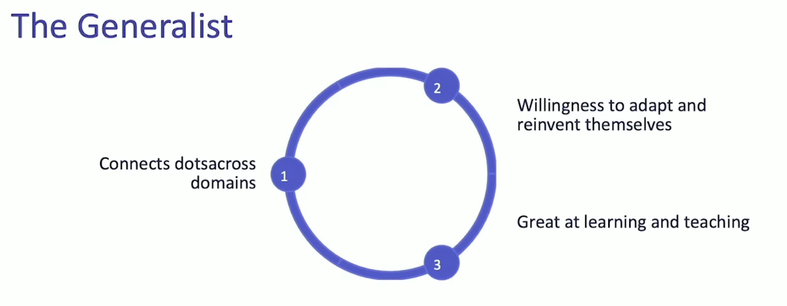
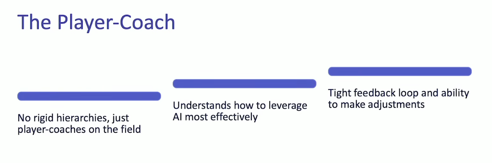

# Tiny Teams

## Definition

**Team composition**: 2-5 senior generalists with AI augmentation

## Key Characteristics

- High expertise concentration, minimal junior staff
- Low ego, high trust, radical transparency
- User-focused, independent execution

#### Characterstics of a Generalist

#### Lead by a Player-Coach

## Operational Playbook

### Hiring
- Extreme selectivity (must be excited about candidate)
- Work trials: 4 days to 3 months

### Operations
- Minimal meetings for deep focus
- Strategic fire-letting (prioritize critical 10%)
- In-person via offices or frequent hack weeks
- Reusable playbooks: "Don't Learn It Twice"

## Future Trends (2026-2030)

- **Gartner prediction**: 80% of orgs will adopt tiny team structures by 2030
- **AI-native platforms**: 40% of new custom apps built by tiny teams (up from 2% in 2025)
- **Platform engineering shift**: Product-centric internal platforms treating devs as customers
- **Core enabler**: AI agents allowing 2-3 people to match output of traditional teams

## Strategic Advantage

"Co-op multiplayer game" model: human + AI capabilities deliver adaptability, resilience, and efficiency unmatched by larger orgs.

---

## Sources

- [The Tiny Teams Playbook - Latent Space](https://www.latent.space/p/tiny)
- [Top 5 Predictions Platform Engineering 2026 - Mia Platform](https://mia-platform.eu/blog/top-5-predictions-platform-engineering-2026/)
